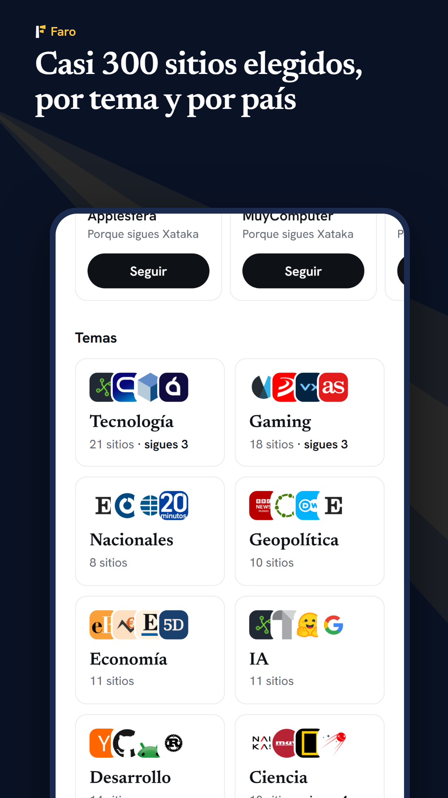
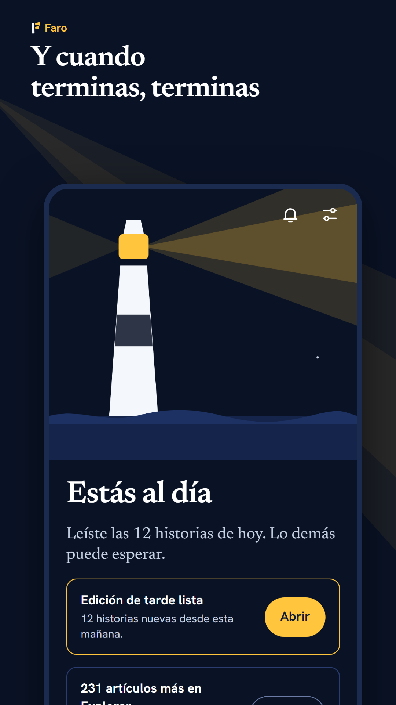

# Faro


Faro es un lector de noticias para Android. Vigila los sitios que eliges y cada día te entrega una lista corta con lo que vale la pena leer. Cuando la terminas, estás al día.

No tiene cuentas, anuncios ni rastreadores, y no depende de ningún servidor propio: todo se guarda en el teléfono y la app habla directamente con los sitios que sigues.

- **Política de privacidad:** https://xsharklinx.github.io/FaroNews/privacidad.html
- **Contacto:** contactosharklin@gmail.com

<p>
  
  
  
  
</p>

## Qué hace

- **Hoy:** hasta doce historias elegidas entre todo lo publicado, en edición de mañana y de tarde. Si varios sitios cuentan lo mismo, las junta y deja comparar.
- **Catálogo:** casi 300 sitios comprobados, por tema y por país, con vista previa antes de seguir. También admite cualquier web por su dirección, canales de YouTube, podcasts, Reddit, Mastodon y Bluesky; si un sitio no tiene feed, lee sus titulares.
- **Temas:** sigue un asunto en todos tus sitios a la vez.
- **Lector:** texto completo sin anuncios, con letra, tamaño y fondo a elegir; resaltados con notas; traducción del inglés al español hecha en el teléfono; enlaces que se abren dentro de la app.
- **Biblioteca:** lo guardado se conserva entero (texto y fotos) aunque el sitio lo borre, con etiquetas y buscador. Los resaltados se exportan a Markdown, Obsidian o Readwise, y un artículo se envía como enlace, texto o PDF.
- **Avisos:** por tema o por sitio, con horas de silencio. Revisa los sitios aunque la app esté cerrada.
- **Podcasts:** cola, velocidad y reproducción con la pantalla apagada.
- **Tus datos:** copia de seguridad en un archivo propio e importación y exportación OPML.

## Cómo está hecha

React 19 + Vite, empaquetada para Android con Capacitor 7. Lo que necesita el sistema (avisos en segundo plano, reproducción, traducción, accesos directos) está en Java, en `android/app/src/main/java/com/faro/lector/`.

| Carpeta | Qué hay |
| --- | --- |
| `src/core/` | Lógica sin red ni disco: leer feeds, elegir Hoy, exportar. Tiene los tests. |
| `src/ports/` | Lo que toca el mundo: red, base de datos, archivos, puente con Android. |
| `src/data/` | Estado de la app y reproductor. |
| `src/screens/`, `src/ui/` | Pantallas y piezas de interfaz. |
| `src/catalog/` | El catálogo de sitios (`catalog.json`). |
| `android/` | Proyecto de Android. |
| `playstore/` | Ficha de Google Play: textos, icono, capturas y política de privacidad. |
| `scripts/` | Utilidades: comprobar el catálogo, generar capturas, compilar. |

## Desarrollo

Hace falta Node 22, pnpm y, para compilar la app, el SDK de Android con su JDK.

```bash
pnpm install
pnpm dev        # la app en el navegador, en http://localhost:5174
pnpm test       # tests
```

En el navegador no hay avisos, traducción ni reproducción en segundo plano: eso solo existe en Android.

## Compilar

```bash
pnpm keystore   # una sola vez: crea la clave de firma (no se sube al repositorio)
pnpm release    # deja en Release/Faro-<versión>/ el .aab y los .apk
```

La versión se cambia solo en `package.json`. La clave de firma (`android/faro-release.jks` y `android/keystore.properties`) vive fuera del repositorio: sin una copia de esos dos archivos no se puede publicar una actualización.

Los pasos para Google Play están en [`playstore/PUBLICAR.md`](playstore/PUBLICAR.md).

## El catálogo

Cada sitio de `src/catalog/catalog.json` se comprueba contra la red antes de entrar:

```bash
node scripts/check-catalog.mjs            # informa de los que fallan
node scripts/check-catalog.mjs --write    # guarda la dirección real de los que funcionan
pnpm catalog:icons                        # descarga los logos que falten
```

La app lleva el catálogo dentro y, una vez por semana, consulta la copia publicada en GitHub Pages; así se puede corregir o ampliar sin sacar una versión nueva. El flujo `.github/workflows/catalogo.yml` publica esa copia, junto con la política de privacidad, en cada cambio, y los lunes revisa todos los feeds y abre una incidencia con los que no respondan.

Para proponer un sitio: «Sugerir un sitio» dentro del catálogo de la app, o una incidencia en este repositorio.
